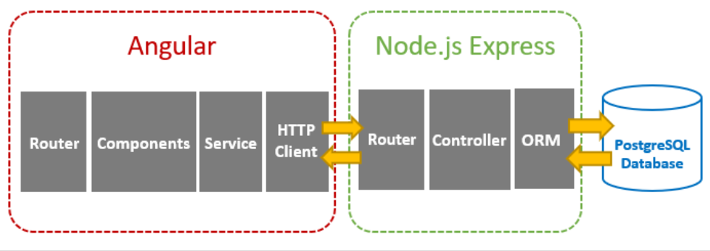
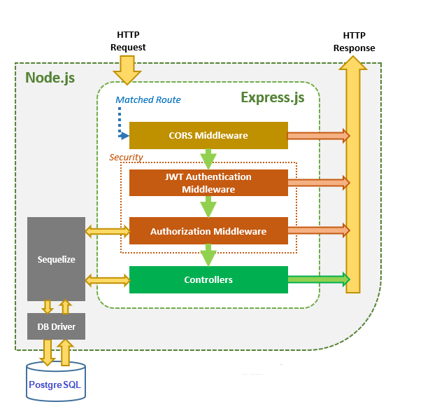
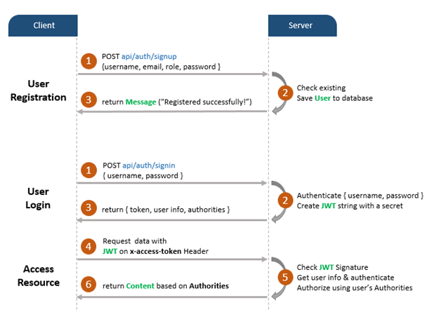
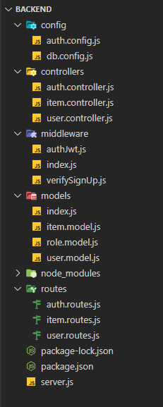

# pean-crud-example
PEAN (PostgreSQL + Node.js Express + Angular 13) stack CRUD example with JWT Authentication &amp; Authorization.

## Intro

This project is a full-stack (Angular 13 + Node.js + PostgreSQL) To-do Application.

The back-end server uses Node.js + Express framework for creating REST APIs and JWT for Authentication & Authorization.

The front-end side is an Angular App with HttpClient and Router.

>This app doesn not use ejs templating engine to render the views. The views are rendered from the client-side as a Single Page Application with Angular 13

## Overview of PEAN stack To-Do applicationwith JWT Authentication & Authorization 

With the **To-Do** application:

-   User can signup  to create new account, or login with username & password.
-   User information is stored in PostgreSQL database
-   The User role (admin,, user), authorizes the User to access resources
- Authorized User can Add/delete a todo item
-   The To-Do item is stored in PostgreSQL database

### Architecture
 
 
• Node.js exports REST APIs & interacts with PostgreSQL Database using Sequelize ORM.  

• Angular Client sends HTTP Requests and retrieves HTTP Responses using HTTPClient, consume data on the components. Angular Router is used for navigating to pages.

## Backend (Node.Js)
 
**HTTP request**  that matches a _Express_  routes, is checked by  **CORS Middleware**  before reaching  the  **Security**  layer of the application

**Security**  layer includes:

-   JWT Authentication Middleware: verify SignUp, verify token
-   Authorization Middleware: check User’s roles with record in database

If these middlewares throw any error, a message is be sent as HTTP response.

**Controllers**  interact with PostgreSQL Database via  _Sequelize_  and send  **HTTP response**  (token, user information and to-do items based on roles) to the client.

###  Flow for Signup & Login with JWT Authentication
The diagram shows flow of User Registration, User Login and Authorization process.

 

###  Technology

-   Express Js for REST APIs
-   bcryptjs for password encrytion
-   jsonwebtoken to token based authentication & authorization
-   Sequelize  for database CRUD operations
-   PostgreSQL for data storage

### Project Structure

 
 
–  **config**

-   configure PostgreSQL database & Sequelize
-   configure Auth Key

–  **routes**

-   `auth.routes.js`: POST signup & signin
-   `user.routes.js`: GET public & protected resources

–  **middlewares**

-   `verifySignUp.js`: check duplicate Username or Email
-   `authJwt.js`: verify Token, check User roles in database

–  **controllers**

-   `auth.controller.js`: handle signup & signin actions
-   `user.controller.js`: return public & protected content

–  **models**  for Sequelize Models

-   `user.model.js`
-   `role.model.js`

–  `server.js`: import and initialize neccesary modules and routes, listen for connections.

### Backend APIs (NodeJS):
These are APIs that Node.js Express App will export:
|     Methods           |Urls|Actions|
|----------------|-------------------------------|-----------------------------|
|POST|/api/auth/signup            |signup new account       |
|POST|/api/auth/signup            |login an account          |
|GET|/api/user|retrieve all users|
|GET|/api/user/:id|retrieve user by id|
|GET|/api/items|retrieve all to-do items|
|GET|/api/items/:id|retrieve to-do item by id|
|DELETE|/api/items/:id|remove a to-do item by id|
